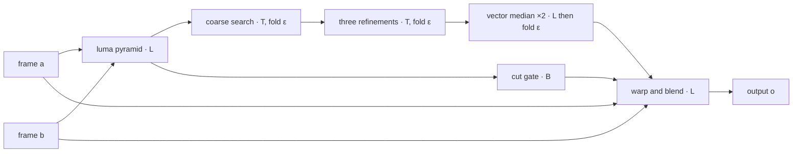

# A lexicon for writing programs as mathematics

*Written 2026-10-04 by Cloud at the owner's request. Every claim a computer can check is checked by
[tests/probes/lexicon/lexicon_check.py](tests/probes/lexicon/lexicon_check.py): run it, and every line must say PASS
or CAUGHT. The equations use LaTeX, which GitHub renders.*

The owner's starting point was "all code is math, so all shader code must be reconcilable as mathematical formulas,
and the notation to write them may not exist yet". The first half is true, in a precise sense this document proves.
The second half is partly true. The pieces mostly exist, scattered across different branches of mathematics. No
single notation brings them together for programs like these shaders, and one object the shader really uses has no
name at all. This document gathers the pieces into one lexicon, names the missing one, and checks every word
against the code.

## Contents

1. [The short version, for everyone](#1-the-short-version-for-everyone)
2. [The base shader in one line, and how it unfolds](#2-the-base-shader-in-one-line-and-how-it-unfolds)
3. [The words](#3-the-words)
4. [Why it is correct: the reviewer's checklist](#4-why-it-is-correct-the-reviewers-checklist)
5. [Is it new, and is it necessary? An honest answer](#5-is-it-new-and-is-it-necessary-an-honest-answer)
6. [Writing it down: LaTeX, plain text and pictures](#6-writing-it-down-latex-plain-text-and-pictures)
7. [Glossary for readers without the background](#7-glossary-for-readers-without-the-background)

---

## 1. The short version, for everyone

Three ideas do almost all the work.

**Every program is a matrix.** A computer holds finitely many bits, so a program can only ever be in finitely many
states. Make a giant table with one row and one column per state, and put a 1 where "this state leads to that
state". That table is a matrix, and running the program twice is multiplying the matrix by itself. This is exact,
and it is a theorem (§3.6). The catch is size. The table for one pass of the shader on one video frame has more rows
than there are atoms in the universe, by an unimaginable margin. So it is a matrix nobody will ever store, but one we
can still reason about. Its eigenvalues, for example, are exactly the program's loops (§3.6).

**"Adding" is a choice.** At school, combining two things means adding them. A search combines its options
differently: it keeps the cheaper one. If "combine" means "take the smaller" and "multiply" means "add", the rules
of algebra still work. You can still multiply matrices, and a whole search becomes one matrix product (§3.2). The
shader uses at least four different "additions": ordinary sums, minimum (in its searches), or (in its thresholds) and
exclusive-or (in the Rule 30 example). Writing which one applies, once per product, is most of the lexicon. This is
also the precise version of the owner's intuition that "plus and minus could be extended": §3.4 shows that the coarse
search writes its answer in digits that take three values, $-1$, $0$ and $+1$, the states of a spin-1 particle.

**The machine has its own arithmetic.** A GPU rounds every result to 24 binary digits. Its "plus" is not quite the
real plus. With exact numbers $(a+b)+c = a+(b+c)$ always holds; with the machine's rounding it can fail (§3.7). The
same rounding, used carefully, can be undone exactly, and that is the trick that lets a computer take part in a proof
([PRIZE-PROBLEMS.md](PRIZE-PROBLEMS.md)).

Einstein's best-known notational trick was to stop writing the summation sign: a repeated index means "add over it".
This lexicon does the same with one more word. A repeated index means "combine over it, in the arithmetic named on
the product".

---

## 2. The base shader in one line, and how it unfolds

The full pass-by-pass equations are in [BIDIRECTIONAL-AS-MATHEMATICS.md](BIDIRECTIONAL-AS-MATHEMATICS.md). Here they
are folded into one line and then unfolded, a level at a time.

**Level 0, the whole shader.** Here $\mathbf a$ and $\mathbf b$ are the two frames, $t$ is the time between them and
$\mathbf o$ is the output:

```math
\boxed{\;\mathbf o \;=\; \mathbf W_t\big[\,\mathfrak F(\mathbf a, \mathbf b)\,\big] \begin{pmatrix} \mathbf a \\ \mathbf b \end{pmatrix}\;}
```

*Say it as:* "the output is the warp at time $t$, built from the motion between $\mathbf a$ and $\mathbf b$, applied to
$\mathbf a$ and $\mathbf b$."

**Level 1, the warp.** $\mathbf W_t$ is a $1 \times 2$ block of sparse matrices in ordinary arithmetic $\mathbb L$.
Each row has at most four non-negative weights summing to one (BIDIRECTIONAL-AS-MATHEMATICS.md §10.2). The cut gate
switches between this and a plain copy:

```math
\mathbf W_t[\boldsymbol\Delta] = \Big(\, (1-t)\,\mathbf M_{-t}(\boldsymbol\Delta) \;\;\; t\,\mathbf M_{1-t}(\boldsymbol\Delta) \,\Big)
\quad\text{if } D \le D_{\text{cut}}, \qquad
\mathbf W_t = \Big(\, \mathbf 1[t < \tfrac12]\,\mathbf I \;\;\; \mathbf 1[t \ge \tfrac12]\,\mathbf I \,\Big) \quad \text{otherwise.}
```

**Level 2, the motion.** $\mathfrak F$ is a composition of five operators. They are applied right to left: the coarse
search $\mathcal S$, three refinements $\mathcal R_\ell$, and the vector median $\mathcal V$ twice:

```math
\mathfrak F = 2\;\mathcal V \circ \mathcal V \circ \mathcal R_H \circ \mathcal R_Q \circ \mathcal R_E \circ \mathcal S .
```

**Level 3, one search.** The coarse search is five margin folds $\rhd_\varepsilon$ (§3.3) in a row. With the margin
at zero, each is a tropical sum with its witness (§3.2):

```math
\mathcal S(\mathbf u) = \rhd^{(4)}_\varepsilon \circ \cdots \circ \rhd^{(0)}_\varepsilon(\mathbf 0),
\qquad
\rhd^{(i)}_0(\mathbf d) = \operatorname*{arg}\, \bigoplus^{\mathbb T}_{\boldsymbol\delta \in \mathcal W_1} J\big(\mathbf d + h_i\, \boldsymbol\delta\big),
\qquad h_i = \tfrac34\, 2^{-i}.
```

The same result, read as digits, is a five-site spin-1 chain (§3.4):

```math
\mathcal S(\mathbf u) = \sum_{i=0}^{4} h_i\, \mathbf s_i, \qquad \mathbf s_i \in \mathbb S_1^{\,2} = \lbrace -1, 0, +1 \rbrace^2 .
```

**Level 4, one cost.** The cost $J$ is a sum of absolute differences of two sparse linear maps of the luma images,
plus a length penalty:

```math
J(\mathbf d) = \mathbf 1^\top \Big\lvert\, \mathbf P\, \mathbf y_A - \mathbf P_{\mathbf d}\, \mathbf y_B \,\Big\rvert + \lambda \lVert \mathbf d \rVert_2 ,
```

with $\mathbf P$ and $\mathbf P_{\mathbf d}$ the bilinear sampling matrices of the $3 \times 3$ window, and
$\mathbf y = \mathbf P_\ell\, \mathbf a\, \mathbf w$ the luma pyramid (linear).

**Level 5, the lift.** Every operator above is a function between finite sets of machine states, so each is a 0/1
matrix (§3.6), and the whole shader is their product, applied right to left:

```math
\mathbf K_{\text{shader}} = \mathbf K_{\text{luma}}\; \mathbf K_{\mathcal S}\; \mathbf K_{\mathcal R_E}\; \mathbf K_{\mathcal R_Q}\; \mathbf K_{\mathcal R_H}\; \mathbf K_{\mathcal V}\; \mathbf K_{\mathcal V}\; \mathbf K_{\mathbf W_t} ,
```

with every arithmetic step inside taken in the machine's arithmetic $\operatorname{fl}$ (§3.7). At this level
nothing is nonlinear any more. The price is the size. For a 1080p frame the coarse search alone reads two luma
images of about $120 \times 68$ texels. If each texel is held as a 32-bit float, that is $522\,240$ bits of input, so
$\mathbf K_{\mathcal S}$ has $2^{522\,240}$ rows.

So the shader is one line at the top and astronomically large at the bottom, and each level is exact.

---

## 3. The words

Each entry gives the symbol, how to say it, what it means, where the shader uses it, and the check that proves it.

### 3.1 An arithmetic (a semiring)

An **arithmetic** $\mathbb A = (A, \oplus, \otimes, \bar 0, \bar 1)$ is a set with a "combine" $\oplus$ and a
"multiply" $\otimes$. Both are associative, $\oplus$ is also commutative, $\otimes$ distributes over $\oplus$, and
$\bar 0$ and $\bar 1$ are their neutral elements, with $\bar 0$ absorbing for $\otimes$. Matrices with entries in
any such arithmetic multiply by the usual rule:

```math
(\mathbf X \otimes_{\mathbb A} \mathbf Y)_{ik} = \bigoplus_{j} \, X_{ij} \otimes Y_{jk} .
```

*Einstein's convention, extended:* $c_i = a_{ij}\, b_j\ [\mathbb A]$ means $c_i = \bigoplus_j a_{ij} \otimes b_j$ in
the arithmetic $\mathbb A$. If no arithmetic is named, it is $\mathbb L$.

| Symbol | Say it as | Set | Combine $\oplus$ | Multiply $\otimes$ | $\bar 0$, $\bar 1$ | Where the shader uses it |
|---|---|---|---|---|---|---|
| $\mathbb L$ | "linear" | real numbers | $+$ | $\times$ | $0$, $1$ | luma, sampling, warp, blend, pooling, derivatives |
| $\mathbb T$ | "tropical" | reals with $+\infty$ | $\min$ | $+$ | $+\infty$, $0$ | every search |
| $\mathbb B$ | "Boolean" | $\lbrace 0, 1 \rbrace$ | or | and | $0$, $1$ | thresholds, gates, masks |
| $\mathbb F_2$ | "F-two" | $\lbrace 0, 1 \rbrace$ | exclusive or | and | $0$, $1$ | Rule 30 (§3.5) |

### 3.2 The tropical sum with its witness

In $\mathbb T$, "combining" a list means keeping its smallest value: $\bigoplus^{\mathbb T}_j x_j = \min_j x_j$. A
search also needs to know *which* entry won. The **witnessed sum**
$\operatorname*{arg}\bigoplus^{\mathbb T}_j x_j$ returns the first index in the list's order that attains the
minimum. It is the tropical sum in the arithmetic of pairs $(\text{cost}, \text{position})$, ordered by cost first
and then by position. *Say it as:* "the tropical winner over $j$." *Checked:* C1 (with the margin at zero, every
round of the shader's search is exactly this, on 400 of 400 random rounds).

### 3.3 The margin fold (the new word)

The shader's searches are not quite tropical sums. They accept a challenger only if it beats the current best by a
relative margin $\varepsilon = 10^{-4}$, so that the last bits of a float cannot decide a near-tie. Starting from an
incumbent $(\mathbf d_0, c_0)$ and visiting candidates in order:

```math
\operatorname{fold}_\varepsilon\big[(\mathbf d_0, c_0);\ \mathbf d_1, \dots, \mathbf d_n\big]:\qquad
(\mathbf d, c) \leftarrow \big(\mathbf d_j, J(\mathbf d_j)\big) \ \text{ whenever } \ J(\mathbf d_j) < (1-\varepsilon)\, c .
```

*Symbol:* $\rhd_\varepsilon$, said "fold with margin epsilon". Three facts:

1. **At $\varepsilon = 0$ it is the witnessed tropical sum** of §3.2 (checked: C1).
2. **For $\varepsilon > 0$ it depends on the order of the candidates** (checked: C3, with costs $0.99985$ and
   $0.9998$ against an incumbent of $1$, the two orders give different winners). So it is not the "combine" of any
   arithmetic; no semiring has an order-dependent sum. That is why standard algebra has no name for it.
3. **It is never far from the true minimum.** If all costs are non-negative, the result's cost $c$ satisfies
   $(1-\varepsilon)\, c \le \min_j J(\mathbf d_j)$, a proof of which is in BIDIRECTIONAL-AS-MATHEMATICS.md §1.

The shader's median uses it too, after an ordinary linear product. The total distances are
$\boldsymbol\Phi = \mathbf D\, \mathbf 1$ in $\mathbb L$, and then $\rhd_\varepsilon$ runs over $\boldsymbol\Phi$
(checked: C4, 500 of 500). Mixed products like this one, a different arithmetic at each step, are how the whole
shader is written.

### 3.4 Spin digits: plus and minus, extended

The owner asked whether plus-and-minus could be extended the way particles have more than two spin states. It can,
and the shader already does it. The two signs $\lbrace -1, +1 \rbrace$ are the two states of a spin-$\tfrac12$
particle. A spin-$s$ particle has $2s+1$ states, $m = -s, \dots, +s$; for spin 1 that is
$\mathbb S_1 = \lbrace -1, 0, +1 \rbrace$.

Each round of the coarse search moves by $h_i$ times a step $\mathbf s_i \in \mathbb S_1^{\,2}$ (or stays put, which
is $\mathbf s_i = \mathbf 0$). So its answer is written in five spin-1 digits per axis:

```math
\mathcal S(\mathbf u) = \sum_{i=0}^{4} h_i\, \mathbf s_i = \frac{3}{64} \sum_{i=0}^{4} 2^{4-i}\, \mathbf s_i ,
\qquad \mathbf s_i \in \mathbb S_1^{\,2} .
```

These are *signed binary digits*. Every integer from $-31$ to $31$ has such a representation, so the coarse search
can reach exactly $63$ values per axis. In the language of physics, the search finds a low-energy state of a chain
of five spin-1 sites, one round at a time, with $J$ as the energy. *Checked:* C2 (the identity holds exactly, with
rational arithmetic, on 180 of 180 blocks; the reachable set is exactly the 63 values).

Mathematics has more ways to extend "$\pm$". The $n$-th roots of unity $e^{2\pi i k/n}$ are the cyclic version, and
§3.6 meets them as the eigenvalues of a program's loops. Clifford algebras extend sign to geometry. The shader uses
the spin-1 kind.

### 3.5 Exclusive or as addition: Rule 30

Rule 30, the cellular automaton behind the Rule 30 prizes, is a shader in all but name: every cell's next value
depends on itself and its two neighbours. In $\mathbb F_2$, where $1 + 1 = 0$, it is a polynomial of degree two in
the left, centre and right cells:

```math
x'_i = x_{i-1} + x_i + x_{i+1} + x_i\, x_{i+1} \pmod 2 .
```

*Checked:* C6 (equal to the rule's table on all 8 neighbourhoods; Rule 90, $x_{i-1} + x_{i+1}$, is caught as
different; and the simulator reproduces the published centre column, OEIS A051023, 102 of 102 terms). The equation
is linear in $x_{i-1}$. That is the property called left-permutivity, which [RULE30-PRIZE.md](RULE30-PRIZE.md)
builds on.

### 3.6 The lift: every program is a matrix

Let $X$ and $Y$ be the finite sets of a program's possible inputs and outputs, and $f: X \to Y$ what it does.
Its **lift** $\mathbf K_f$, said "K of f", is the $|X| \times |Y|$ matrix

```math
(\mathbf K_f)_{x y} = \mathbf 1\big[\, f(x) = y \,\big] .
```

On any table of numbers $\varphi$ indexed by outputs, $(\mathbf K_f\, \varphi)(x) = \varphi(f(x))$. That is linear in
$\varphi$, however nonlinear $f$ is. Running $f$ and then $g$ gives $\mathbf K_{g \circ f} = \mathbf K_f\, \mathbf K_g$,
because $\sum_y \mathbf 1[f(x) = y]\, \mathbf 1[g(y) = z] = \mathbf 1[g(f(x)) = z]$.
This is the Koopman operator (Koopman, 1931), here on a finite set, and it is the exact sense in which all code is
matrix mathematics.

**Its spectrum is the program's loops.** When a program maps a set of $n$ states to itself ($X = Y$, as one step of
a simulation does), every state eventually falls into a cycle. If $f$ has cycles of lengths
$L_1, \dots, L_k$ covering $c$ of the $n$ states, then

```math
\det\big(x\,\mathbf I - \mathbf K_f\big) = x^{\,n-c} \prod_{j=1}^{k} \big(x^{L_j} - 1\big).
```

The eigenvalues are $0$ for the transient states and the $L_j$-th roots of unity for each cycle. *Proof:* order the
states with the cyclic ones first. $\mathbf K_f$ is then block triangular. The cyclic block is a permutation matrix,
which contributes $\prod (x^{L_j} - 1)$. The other block is nilpotent, because every transient state reaches a cycle
in finitely many steps, and it contributes $x^{n-c}$. *Checked:* C5 (exact characteristic polynomials of 60 random
maps; a cycle length off by one is caught).

So "is this sequence eventually periodic?", the question of Rule 30 Problem 1 and of the Collatz cycles, is a
question about the eigenvalues of a lift. For Rule 30 the lift is infinite, which is exactly why the question is
hard.

### 3.7 The machine's arithmetic

$\operatorname{fl}(x)$, said "float of x", rounds a real number to the nearest 32-bit float, ties to even. The GPU's
addition is $a \boxplus b = \operatorname{fl}(a + b)$, said "a box-plus b". It is commutative but **not
associative** (checked: C7, $(2^{24} \boxplus 1) \boxplus 1 = 2^{24}$ while $2^{24} \boxplus (1 \boxplus 1) = 2^{24} + 2$).

The rounding can nevertheless be undone exactly. Knuth's **TwoSum** computes, with six rounded operations, a pair
$(s, e)$ with $s = a \boxplus b$ and

```math
a + b = s + e \quad \text{exactly, in real arithmetic.}
```

*Checked:* C7, 3000 of 3000 random float32 pairs, in exact rational arithmetic. A compiler that "simplifies"
$(s - (s - b)) \to b$ destroys this, and the counterfactual shows it: after that simplification only 209 of 3000 pairs
are exact. Whether a GPU's compiler leaves TwoSum alone is therefore a measurement, not an assumption. It is the first
job in [PRIZE-PROBLEMS.md](PRIZE-PROBLEMS.md).

---

## 4. Why it is correct: the reviewer's checklist

`python3 tests/probes/lexicon/lexicon_check.py` (about 7 seconds on one CPU core):

| Check | Claim | Result | Counterfactual (must be caught) |
|---|---|---|---|
| C1 | The coarse search equals five margin folds; at zero margin each fold is a witnessed tropical sum | 180 of 180 blocks; 400 of 400 rounds | the fold replaced by an ordinary average: 180 of 180 differ; `REG_LAMBDA` 0.06 → 0.3: 145 of 180 differ |
| C2 | The coarse result is $\sum_i h_i \mathbf s_i$ with spin-1 digits; 63 reachable values per axis | 180 of 180, exact rationals; 63 values | (C1's counterfactuals) |
| C3 | The margin fold is order-dependent for $\varepsilon > 0$, order-free at $0$ | both shown | — |
| C4 | The median is a linear product followed by a margin fold | 500 of 500 | — |
| C5 | A program's 0/1 matrix has characteristic polynomial $x^{n-c}\prod(x^{L}-1)$ | 60 of 60 random maps | a cycle length off by one |
| C6 | Rule 30 is $x_{i-1}+x_i+x_{i+1}+x_i x_{i+1}$ over $\mathbb F_2$; the simulator matches OEIS A051023 | 8 of 8; 102 of 102 terms | Rule 90 in its place |
| C7 | Float addition is not associative; TwoSum is exact | shown; 3000 of 3000 | TwoSum after fast-math: 209 of 3000 |

The GLSL ports in the script follow the shader line by line: the scan order, the strict `<`, the running best cost,
`TIE_MARGIN`, the starting step and its halving, and the contrast gate. They were checked against
`shaders/bidirectional-interpolation.glsl` at commit `be6fd30`. The ports run in double precision, so C1 compares two
forms of one computation, not the GPU against the CPU.

---

## 5. Is it new, and is it necessary? An honest answer

**What is not new.**
- Semirings and tropical algebra are standard: Gondran and Minoux, *Graphs, Dioids and Semirings* (2008); Maclagan
  and Sturmfels, *Introduction to Tropical Geometry* (2015).
- The Iverson bracket is Iverson's (1962).
- The lift is Koopman's (1931). Its spectral form on finite sets is a classical fact about functional graphs.
- TwoSum is Knuth's, with error-free transformations developed by Møller, Dekker, and Ogita, Rump and Oishi (2005).
- Signed-digit number systems go back to Colson (1726) and Cauchy (1840).
- Drawing linear maps as diagrams is Penrose's (1971).

Claiming any of these would be wrong.

**What is new here.**
- **The margin fold has no name in standard algebra.** It is an order-dependent fold, not a semiring operation, with
  a proven bound. The shader depends on it for determinism.
- **The spin-digit reading of the coarse search,** and the reachable-set consequence that the record now confirms on
  the GPU. Local measured 15.75 px for a 16 px motion (REPAIRS.md, L4).
- **One notation spanning all four arithmetics, the lift and the machine's rounding,** applied to a real GPU program
  and machine-checked against it.

**Is it necessary?** Not in the sense that standard mathematics *cannot* express the shader: BIDIRECTIONAL-AS-MATHEMATICS.md
already does, with cases and loops written out. It is useful in the sense that a good notation is useful. Every loop
becomes one product, every pipeline becomes a word of operators, and words can be compared, composed and bounded. Two
facts became visible only once the search was written this way: the quarter-pixel lattice and the 63 reachable
values.

**What a notation cannot do** is supply a missing idea. Leibniz's $dx$, Einstein's summation and Dirac's bra-ket each
made hard thinking easier, and none of them proved a theorem by itself.
[PRIZE-PROBLEMS.md](PRIZE-PROBLEMS.md) is about where an idea, rather than notation, might come from.

---

## 6. Writing it down: LaTeX, plain text and pictures

**LaTeX** (these all render in GitHub's MathJax, and are checked by the same compiler that checked the other
documents):

| Word | LaTeX | Plain text |
|---|---|---|
| an arithmetic | `\mathbb{L}`, `\mathbb{T}`, `\mathbb{B}`, `\mathbb{F}_2` | `[+x]`, `[min+]`, `[or-and]`, `[xor-and]` |
| product in an arithmetic | `\mathbf X \otimes_{\mathbb T} \mathbf Y` | `X (min+) Y` |
| witnessed tropical sum | `\operatorname*{arg}\bigoplus^{\mathbb T}_{j}` | `argmin_j` (first in order) |
| margin fold | `\rhd_\varepsilon` | `fold[eps]` |
| spin-1 digits | `\mathbb S_1 = \lbrace -1,0,+1 \rbrace` | `{-1,0,+1}` |
| lift | `\mathbf K_f` | `K(f)` |
| machine addition | `a \boxplus b`, `\operatorname{fl}(x)` | `fl(a+b)` |
| indicator | `\mathbf 1[P]` | `[P]` |

**Pictures.** A pipeline is a chain of boxes, each box labelled with its arithmetic, and the wires are textures.
This is Penrose's notation for tensors with an arithmetic on every box:



---

## 7. Glossary for readers without the background

| Symbol | Say it | Means, in plain words |
|---|---|---|
| $\oplus$ | "o-plus" | "combine", whatever that means in the arithmetic in use: add, keep the smaller, or |
| $\otimes$ | "o-times" | "multiply", in the same arithmetic |
| $\min$ | "min" | the smallest of a list |
| $\arg$ | "arg" | *which* item won, rather than its value |
| $\varepsilon$ | "EP-sih-lon" | a small number; here $10^{-4}$, one part in ten thousand |
| $\lambda$ | "LAM-da" | a weight; here how much a longer move is penalised |
| $\mathbf 1[P]$ | "one if P" | $1$ when the statement $P$ is true, $0$ when it is false |
| $\sum$ | "sum" | add up everything that follows, over the range written below and above |
| $\circ$ | "after" | do the right-hand thing first, then the left-hand thing |
| $\in$ | "in" | is one of |
| $\lbrace -1, 0, +1 \rbrace$ | "the set minus one, zero, plus one" | the three values a spin-1 digit can take |
| $\mathbf K_f$ | "K of f" | the giant table that says where every state of a program goes |
| $\operatorname{fl}(x)$ | "float of x" | $x$ rounded the way the GPU rounds it |
| $\boxplus$ | "box-plus" | the GPU's addition: add, then round |
| $2^{522\,240}$ | "two to the five hundred and twenty-two thousand, two hundred and forty" | a number with about 157,000 digits |
